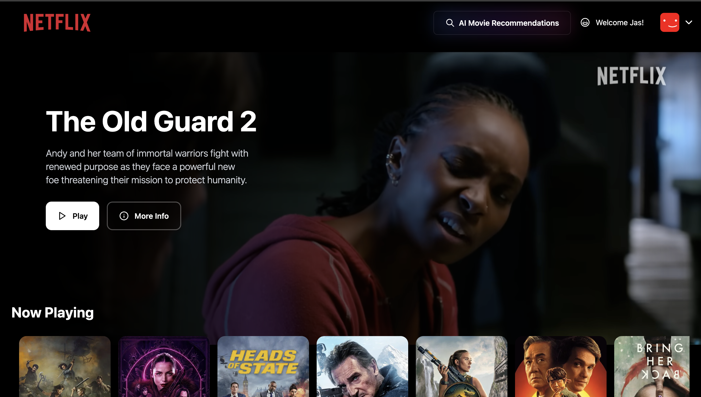
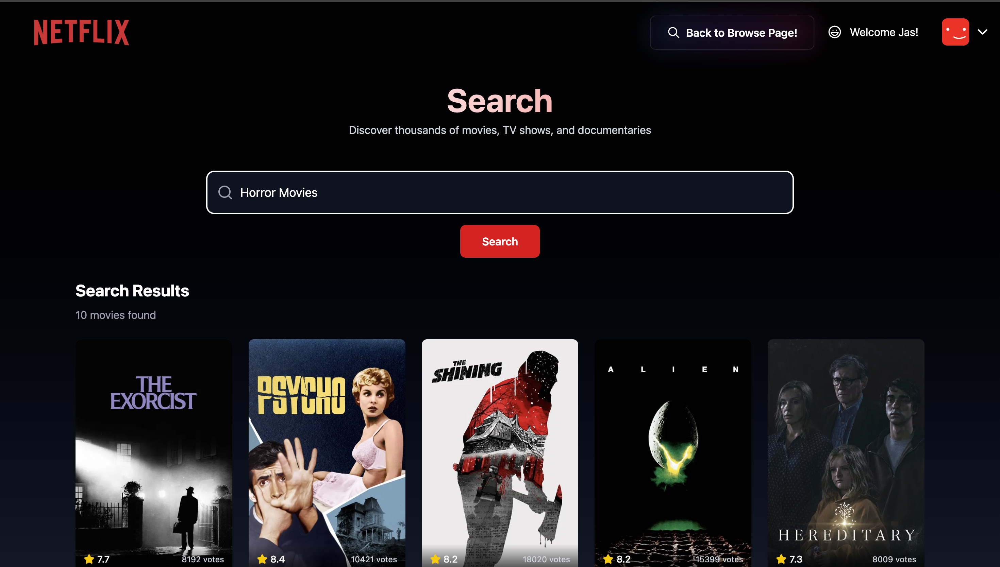
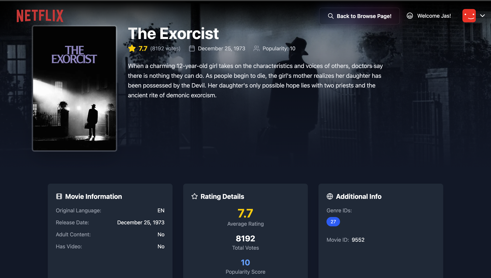

# Netflix-Gemini

A Netflix-inspired, AI-powered movie discovery and streaming interface. Blazing fast with Vite, styled with Tailwind CSS, authenticated with Firebase, global state managed via Redux Toolkit, and enhanced with Gemini AI search + recommendations, leveraging TMDB APIs.

**Live Demo:**  
[https://netflixgemini-91781.web.app/](https://netflixgemini-91781.web.app/)

---

## 📸 Screenshots

Explore key features and UI of Netflix-Gemini below:

| Login Page                        | Browse Page                       |
| ---------------------------------- | --------------------------------- |
|        |   |

| AI Search Page                    | Movie Page                        |
| ---------------------------------- | --------------------------------- |
|      |       |

| Browse Page 2                     |
| --------------------------------- |
|   |

<details>
  <summary>Click to expand for a closer look</summary>
  <ul>
    <li><strong>Login Page:</strong> Clean, secure Firebase authentication for sign-in/sign-up</li>
    <li><strong>Browse Page:</strong> Scroll through curated movie lists, trailers, and recommendations</li>
    <li><strong>AI/Search Page:</strong> Use Gemini AI to search for movies by mood, genre, or description</li>
    <li><strong>Movie Page:</strong> See detailed info and embedded trailers for any selected movie</li>
    <li><strong>Browse Page 2:</strong> Demonstrates UI flexibility and responsive layout</li>
  </ul>
</details>


## ✨ Features

- **Lightning-fast Vite build**
- **Fully Responsive UI** with TailwindCSS
- **Modern Auth:** Firebase login, signup, profile management, and protected routing
- **Redux Toolkit:** Modular state management (`userSlice`, `moviesSlice`, `geminiSlice`)
- **Robust Movie Data:** Fetches “Now Playing”, Popular, Top Rated, Upcoming from TMDB
- **Custom React Hooks** for all major data needs (e.g. `useNowPlayingMovies`, `usePopularMovies`, etc.)
- **Embedded Trailers:** YouTube player (autoplay + muted)
- **Gemini AI Search:** Natural-language movie search, smart suggestions
- **Form Validation** (custom logic)
- **Memoized Selectors** for performance
- **Instant Logout/Redirects:** Secure route transitions
- **Production-Ready Firebase Hosting**
- **Strong Code Structure:** Scalable, maintainable folders and code
- **Environment Variable Management:** Easy `.env` config for all secrets/API keys
- **Accessibility & Usability** in mind

---

## 🖥️ Tech Stack

- [Vite](https://vitejs.dev/) (React + super-fast dev/build)
- [React](https://react.dev/)
- [TailwindCSS](https://tailwindcss.com/)
- [Redux Toolkit](https://redux-toolkit.js.org/)
- [Firebase](https://firebase.google.com/) (Auth + Hosting)
- [TMDB API](https://www.themoviedb.org/documentation/api)
- [Gemini AI](https://ai.google.dev/gemini-api/docs) (for semantic movie search)
- [YouTube Iframe API](https://developers.google.com/youtube/iframe_api_reference)
- [React Router](https://reactrouter.com/)
- Modern JavaScript (ES2022+)

---

## 📁 Project Directory Structure

```

/netflix-gemini
├── public/
│   └── ...            # static assets
├── src/
│   ├── components/
│   │   ├── Gemini/
│   │   │   ├── GeminiButton.jsx
│   │   │   ├── GeminiSearchBar.jsx
│   │   │   ├── GeminiSearchPage.jsx
│   │   │   └── GeminiSearchSuggestions.jsx
│   │   ├── Body.jsx
│   │   ├── Browse.jsx
│   │   ├── ErrorMessage.jsx
│   │   ├── Form.jsx
│   │   ├── Header.jsx
│   │   ├── Loading.jsx
│   │   ├── Login.jsx
│   │   ├── MainContainer.jsx
│   │   ├── MovieCard.jsx
│   │   ├── MovieList.jsx
│   │   ├── MoviePage.jsx
│   │   ├── ProfileToggleButton.jsx
│   │   ├── SecondaryContainer.jsx
│   │   ├── VideoBackground.jsx
│   │   └── VideoTitle.jsx
│   ├── hooks/
│   │   ├── useGeminiToGetMovies.js
│   │   ├── useMovieTrailer.js
│   │   ├── useNowPlayingMovies.js
│   │   ├── usePopularMovies.js
│   │   ├── useTopRatedMovies.js
│   │   ├── useTruncateWords.js
│   │   └── useUpcomingMovies.js
│   ├── Redux/
│   │   ├── appStore.js
│   │   ├── geminiSlice.js
│   │   ├── moviesSlice.js
│   │   └── userSlice.js
│   ├── utils/
│   │   ├── constants.js
│   │   ├── firebase.js
│   │   ├── geminiAi.js
│   │   ├── SearchTMDBMovie.js
│   │   ├── utilityFunctions.js
│   │   └── validateCredentials.js
│   ├── App.jsx
│   ├── index.css
│   └── main.jsx
├── .env                 # Environment variables (not committed)
├── .gitignore
├── .firebaserc
├── firebase.json
├── vite.config.js
├── package.json
├── README.md            # <--- This file
└── ...                  # ESLint, config files, etc.

````

---

## 🏁 Getting Started (Local Development)

**1. Prerequisites:**
- Node.js v16+ (use [nvm](https://github.com/nvm-sh/nvm) if possible)
- npm or yarn (npm recommended)
- Firebase account
- TMDB API Key
- Gemini AI API Key

**2. Clone this repository:**
```bash
git clone https://github.com/Arbiter09/NetflixGemini-AI-Movie-Recommendation-App.git
cd NetflixGemini-AI-Movie-Recommendation-App
````

**3. Install dependencies:**

```bash
npm install
# or
yarn install
```

**4. Configure environment variables:**
Create a `.env` in the project root:

```env
VITE_FIREBASE_API_KEY=your-firebase-api-key
VITE_FIREBASE_AUTH_DOMAIN=your-firebase-auth-domain
VITE_FIREBASE_PROJECT_ID=your-firebase-project-id
VITE_FIREBASE_APP_ID=your-firebase-app-id
VITE_TMDB_API_KEY=your-tmdb-api-key
VITE_GEMINI_API_KEY=your-gemini-api-key
```

**5. Start local development:**

```bash
npm run dev
# or
yarn dev
```

* App runs at [http://localhost:5173](http://localhost:5173) by default.

---

## ⚙️ Firebase Setup & Deployment

**1. [Install Firebase CLI](https://firebase.google.com/docs/cli):**

```bash
npm install -g firebase-tools
```

**2. Login & Initialize Hosting:**

```bash
firebase login
firebase init hosting
# (Choose: "Use an existing project", select your Firebase project)
```

**3. Build & Deploy:**

```bash
npm run build
firebase deploy
```

* Your app will be deployed to your Firebase Hosting URL.

---

## 🔑 Environment Variables Explained

| Variable Name                | Purpose                              |
| ---------------------------- | ------------------------------------ |
| VITE\_FIREBASE\_API\_KEY     | Firebase Auth + Database             |
| VITE\_FIREBASE\_AUTH\_DOMAIN | Firebase Auth domain                 |
| VITE\_FIREBASE\_PROJECT\_ID  | Firebase project ID                  |
| VITE\_FIREBASE\_APP\_ID      | Firebase app instance                |
| VITE\_TMDB\_API\_KEY         | TMDB API key for movie data          |
| VITE\_GEMINI\_API\_KEY       | Gemini AI API key (for smart search) |

*Never commit your real API keys or secrets to GitHub!*

---

## 🗃️ Key Features: Implementation Breakdown

* **Authentication:**
  Firebase Authentication for user sign-up, login, logout, and profile updates (displayName, photoURL).
  Custom form validation (email/password rules), error messages, redirects on auth state changes.

* **Movie Data:**
  Custom hooks (e.g. `useNowPlayingMovies`, `usePopularMovies`, `useMovieTrailer`) to fetch, cache, and update TMDB movie lists and trailer data.

* **AI Search:**
  `useGeminiToGetMovies` + GeminiSearchBar + GeminiSearchSuggestions for natural-language search. Gemini AI parses queries like "funny sci-fi from the 90s" or "feel-good thrillers" and suggests movies accordingly (combining Gemini results with TMDB data).

* **UI & Navigation:**
  Main navigation via Header; all major routes managed via React Router v6+. `/login`, `/signup`, `/browse`, `/profile`, `/search` etc., with protected routes and clean redirect logic.

* **Redux State:**
  App-wide state for user/session, movie lists, Gemini search results, and more. Each slice handles async fetching, caching, and error states.

* **Reusable Components:**

  * `MovieCard`, `MovieList`, `ProfileToggleButton`, `VideoBackground`, `VideoTitle`
  * `GeminiButton`, `GeminiSearchBar`, `GeminiSearchPage`, `GeminiSearchSuggestions`

* **Performance:**

  * Memoization for expensive selectors
  * Split components (Gemini features, movie browsing, etc.)
  * Lazy loading of assets

* **Responsive Design:**
  Tailwind breakpoints; optimized for mobile, tablet, desktop.

---

## 🚩 Troubleshooting & Tips

* **Stuck on loading / No data?**

  * Double check your TMDB/Gemini API keys in `.env`
  * Make sure your Firebase project is correctly set up
  * Check browser console for specific errors

* **Deploy fails?**

  * Make sure `firebase.json` is correctly set up for single-page app (`"rewrites": [{ "source": "**", "destination": "/index.html" }]`)
  * Run `firebase login` again if needed

* **Want to customize the UI?**

  * Tweak Tailwind classes in `index.css` and component files
  * Edit theme colors in `tailwind.config.js` if desired

---

## 🤝 Contribution Guide

1. **Fork the repo**
2. **Create a new feature branch**
3. **Push your changes and open a PR**
4. For any bugs or suggestions, open an issue!

---

## 📜 License

[MIT License](./LICENSE)

---

## 🙏 Credits

* Movie data via [TMDB](https://www.themoviedb.org/)
* Authentication + Hosting by [Firebase](https://firebase.google.com/)
* AI search by [Gemini AI](https://ai.google.dev/)
* Styling by [TailwindCSS](https://tailwindcss.com/)
* Built with [Vite](https://vitejs.dev/) + [React](https://reactjs.org/)

---
